# gregblur Pipeline Architecture

How gregblur transforms a raw camera frame into a professional-looking blurred-background composite — entirely on the GPU via WebGL2.

## Overview

Every video frame passes through 8 GPU stages in a single draw cycle. The pipeline never touches the CPU for pixel work — all compositing, filtering, and blurring happens in fragment shaders operating on WebGL2 framebuffer objects (FBOs).

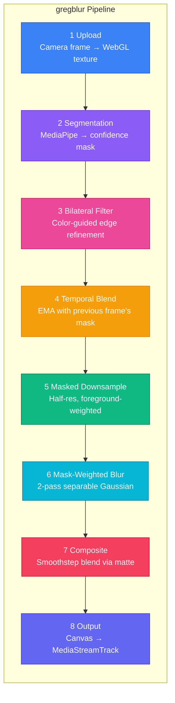

## Stage-by-Stage Breakdown

### Stage 1 — Upload

The raw camera frame (from `VideoFrame`, `HTMLVideoElement`, or `HTMLCanvasElement`) is uploaded to a WebGL2 RGBA texture. A copy shader with Y-flip normalises the camera orientation into a consistent coordinate space for all subsequent passes.

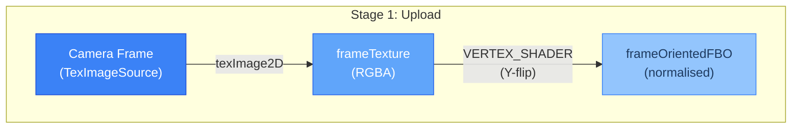

### Stage 2 — Segmentation

The segmentation provider (MediaPipe by default) analyses the frame and produces a **confidence mask** — a single-channel texture where each pixel is a probability between 0.0 (definitely person) and 1.0 (definitely background).

This is fundamentally different from a binary mask. Confidence values give native soft edges around hair, glasses, and clothing without any post-processing.

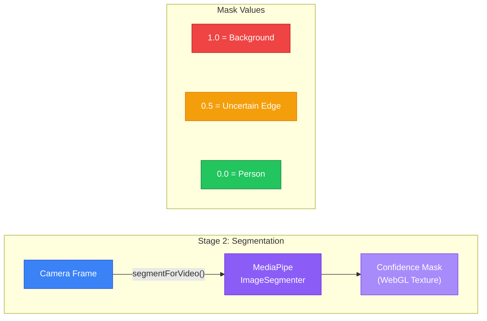

### Stage 3 — Joint Bilateral Filter

The raw confidence mask has fuzzy, low-resolution edges (MediaPipe runs at 256x256). The bilateral filter uses the **original frame's colour** as a guide signal to snap mask edges to real image boundaries.

Where the image is uniform (wall, desk), the filter smooths the mask. Where there's a real edge (hair against wall, glasses frame), dissimilar colours suppress smoothing and the edge stays sharp.

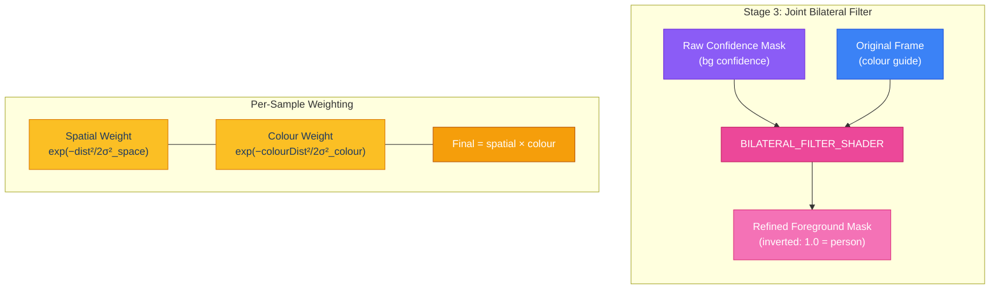

### Stage 4 — Temporal Blend

Frame-to-frame mask jitter causes visible flickering, especially on profile turns. Temporal blending applies an exponential moving average (EMA): 76% current frame + 24% previous frame.

The previous frame's mask is stored in `prevMaskFBO` and updated every frame.

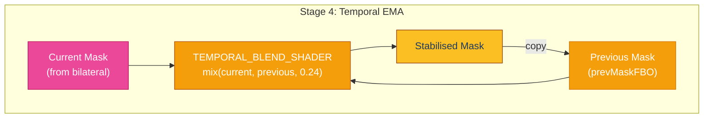

### Stage 5 — Masked Downsample

Before blurring, the frame is downsampled to half resolution. But naive downsampling would bake the subject's pixels into the low-res texels, creating ghosting artifacts.

The masked downsample shader weights each sample by `(1 - foreground)`, so person pixels contribute less to the downsampled background.

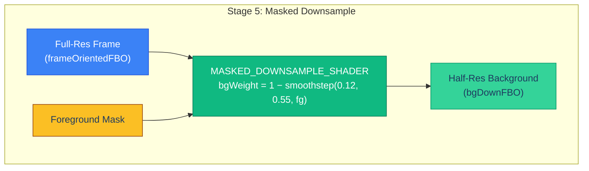

### Stage 6 — Mask-Weighted Gaussian Blur

This is the key anti-halo technique. A naive Gaussian blur smears foreground pixels into the background, creating a bright "ghost" around the subject.

The mask-weighted blur multiplies each Gaussian sample by `(1 - maskVal)`, suppressing foreground contributions. The blur is separable (horizontal + vertical passes) for O(r) instead of O(r²) samples.

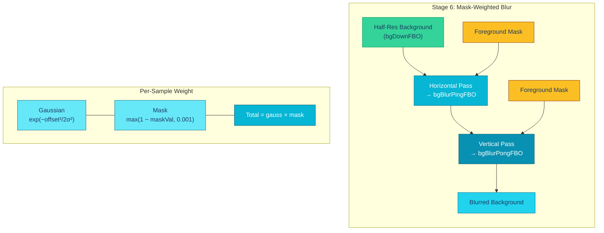

### Stage 7 — Composite

The final composite mixes the blurred background with the original frame using the foreground mask. The `smoothstep(0.26, 0.72, mask + 0.035)` function creates a clean, tunable soft edge.

The `+0.035` offset is foreground-biased — it preserves ears, temples, and profile edges even when MediaPipe's model is conservative.

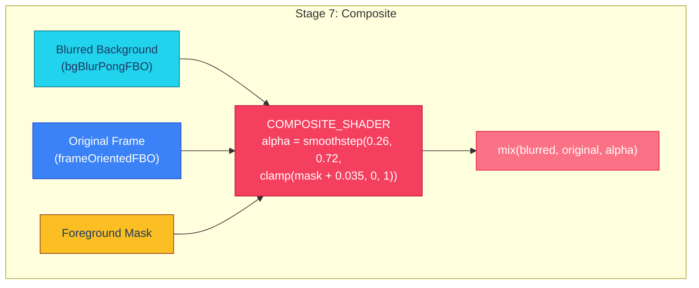

### Stage 8 — Output

The composited result is rendered to the pipeline's canvas. Two output paths are available:

- **Insertable Streams** (Chrome/Edge): Zero-copy via `TransformStream` — each frame is wrapped in a new `VideoFrame` from the `OffscreenCanvas`
- **Fallback** (Safari/Firefox): The canvas is captured via `captureStream(30)` and the resulting `MediaStreamTrack` is used directly

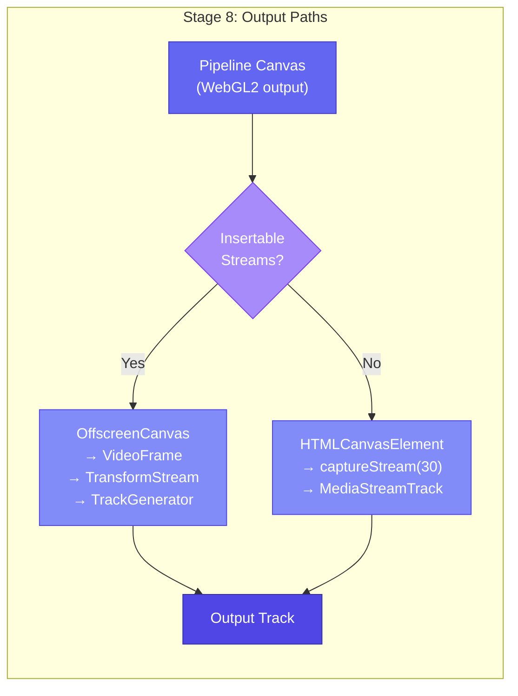

## GPU Resource Map

All FBOs and textures used in a single frame, showing how data flows between them.

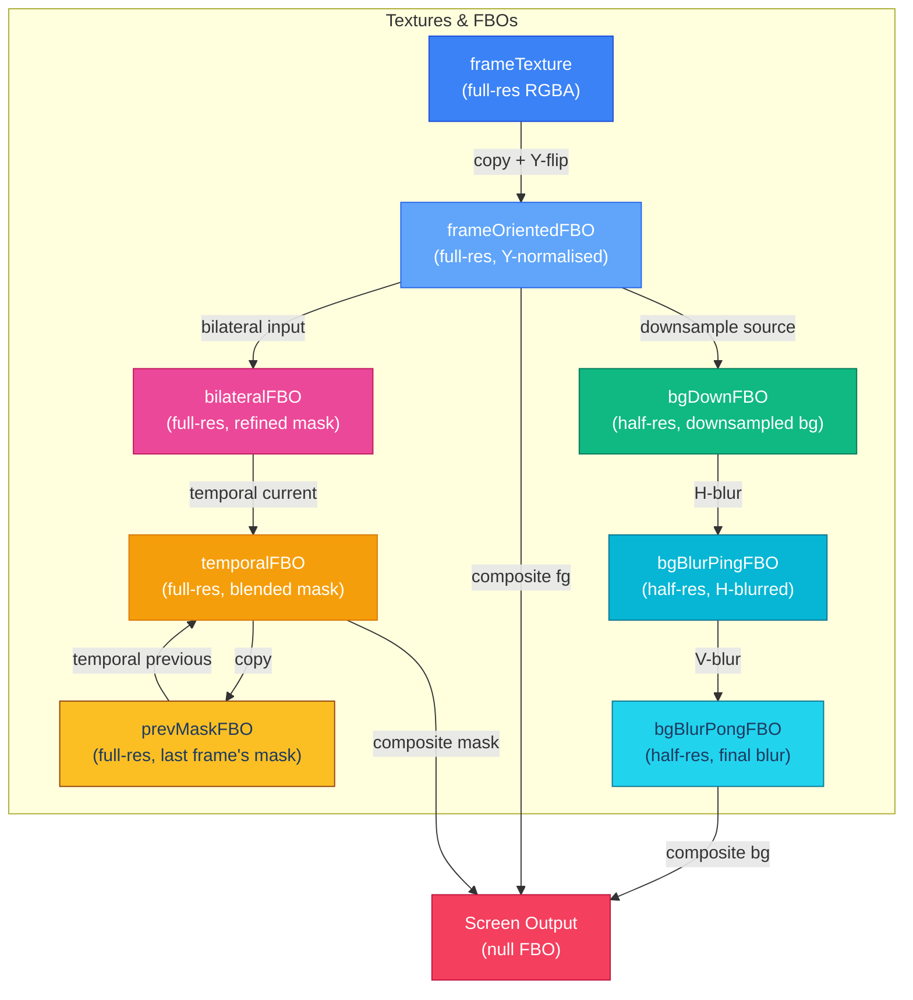

## Shader Program Map

Which vertex + fragment shader pairs make up each program, and where each program is used in the pipeline.

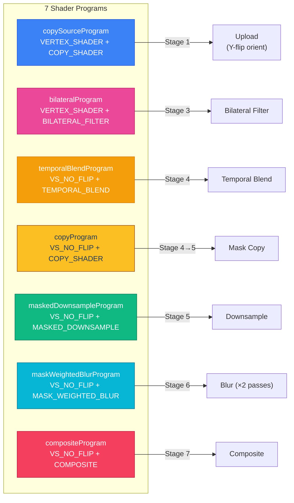

## Why Each Stage Matters

| Stage | Without It | With It |
|---|---|---|
| **Bilateral filter** | Fuzzy edges — hair and glasses blend into background | Sharp edges aligned to real image boundaries |
| **Temporal blend** | Visible flickering on every frame, especially profile turns | Smooth, stable mask transitions |
| **Masked downsample** | Subject pixels baked into blur texels → ghosting | Clean background without foreground contamination |
| **Mask-weighted blur** | Bright "halo" around the subject from foreground bleed | Foreground suppressed — no halo artifacts |
| **Foreground bias** | Ears, temples, thin hair lost on profile turns | +0.035 offset preserves conservative model predictions |
| **Smoothstep composite** | Hard, jaggy transition between person and blur | Clean soft edge with tunable falloff |
